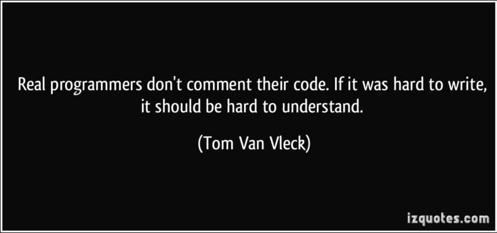

*The Truth?? Obviously not!*

  For people new to programming, the idea of conforming code to a set template/structure is un-individualistic and a waste of time and energy. The process of arranging one’s code to a certain standard oppresses the programming code aesthetic of some people and even worse makes them do more work. Since no one likes doing more work than they have to (unless they really like what they do or something) why do we even bother wasting our time learning about and producing code formatted to other people's standards? The answer to this question depends upon who reads your code. If your code is never read by anyone beside yourself, then coding standards mean nothing to you. However, if a piece of code that you created is intended for other peoples use as well, then you may want to re-think your stance on coding standards. 

  Coding standards are important because not only one person produces code. As I said before, while it is oppressive to have to produce code based off of other people’s standards, the benefits far out weight the disadvantages. By creating a uniform framework for how code should be written, multiple people can more effectively work together to produce larger pieces of code. In addition coding standards make it easier to understand and use other peoples code even without having any prior knowledge about what that code does. This is especially useful in the realm of teaching. While students obviously do not enjoy learning code standards, the fact that all code is presented to them in a uniform way can decrease the learning curve. This is because rather than being preoccupied with deciphering the structure of code, students can go straight to understanding the functionality and use of a particular piece of code. 

  The process of producing computer programs is just like creating a physical object like a house or a car. It often requires that multiple people each with their own specialties work together to produce a final product. Thus, aside from an overall understanding of a project, coding standards are another way to streamline the production process and create a quality product. 
