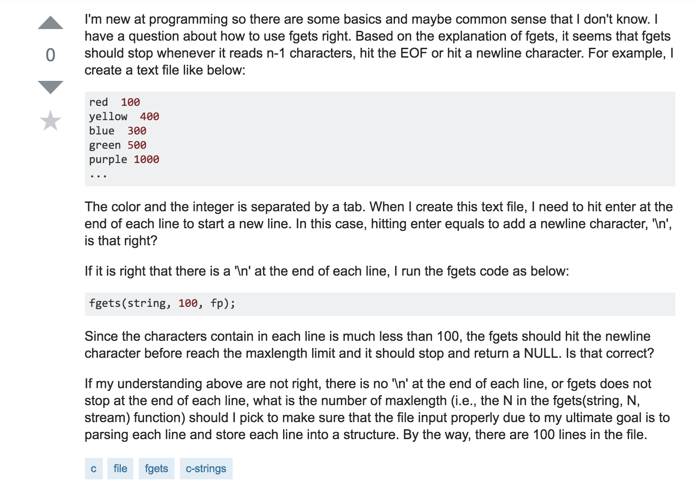
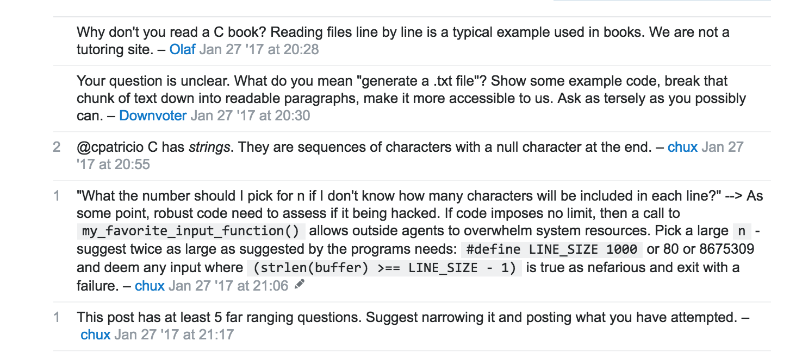

  Before we address the topic of this essay, I think it’s important to first delve in and understand what constitutes a good and bad question. While there are articles all over the web written by disgruntled people explaining what a bad question is, why they hate people who write it, etc., to sum it all up a bad question is basically a question written by a “helpless” person. No one likes dealing with someone who has the ability to do something on their own but always defaults to others for assistance. Whether it is because they have a helpless nature, crave instant results without doing work or some other negative personality trait, few people like giving answers to these kinds of individuals. So when questions arise on the internet (or in person) in this kind of “helpless” format its understandable why some many people dislike bad questions. 
  
  An example of a bad question is in the picture below:
  
  *This question comes from the popular site Stack OverFlow*
  
  which is followed by the comments:
  
  *These comments comes from the popular site Stack OverFlow*
  
The comments for this post clearly represent the sentiment many users in the community feel when stumbling onto these types of bad questions. Everything asked by the person who posted this question could be found in a C book and the question was basically a broad question about how to use the ```fgets()``` function in C.  

  In contrast to that bad question, lets see an example of a good question. [Please click here, the post is rather long](https://stackoverflow.com/questions/14732881/write-to-text-file-outside-of-webroot-directory). 
  
  As you can see in this example the person asking the question came prepared. They fully explained what they tried/found on their own and included every relevant piece of code in a properly formatted way. The community response was overwhelmingly positive and as a result a back and forth communication channel between the person asking the question and the community started. These kinds of posts are often beneficial because they are not only helpful to the person asking the question, but are also helpful to other with the same problem because the problem and problem solving process are fully laid out.  

  Now, after seeing the comparison between a good and bad question above, in what world is a bad question actually good? Maybe this is just from personal experience, but whenever I search for answers online it is often responses to bad questions that give me the answers I need. Some person in the past who just like me didn’t know much about what they were doing posted a “helpless” question on a message board or site and later a kind and merciful soul came along. Like they could read the mind of the person asking the question they succinctly and thoroughly answer the question to the benefit of the asker and me. While this does enable bad habits like seeking instant results without doing any work, it does also allow inexperienced people like myself who are unsure of where to get started a foundation to work with. It is definitely not a very stable foundation, but if you have no idea where to start building from, anything is better than nothing (in most cases). Honestly, I used to think websites were magic, I had not idea how they worked. Without any prior knowledge and no starting point, by google searching questions and looking through both good and bad question on sites like Stack OverFlow I figured out how websites are structured and the specific role various programming languages have in creating websites. 
  
  Bad questions are thus both good and bad. They are a pain to deal with as a person answering them but for someone browsing the internet, they can be incredibly helpful. 


