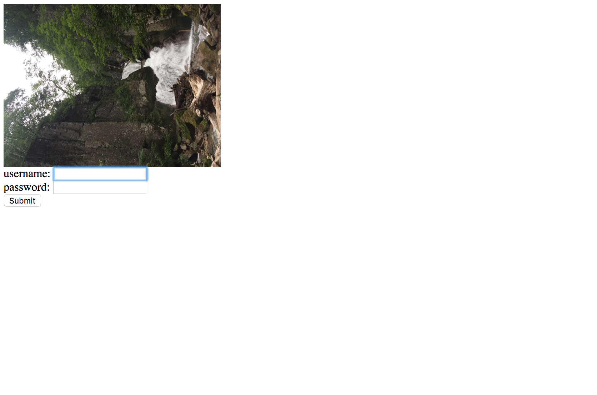
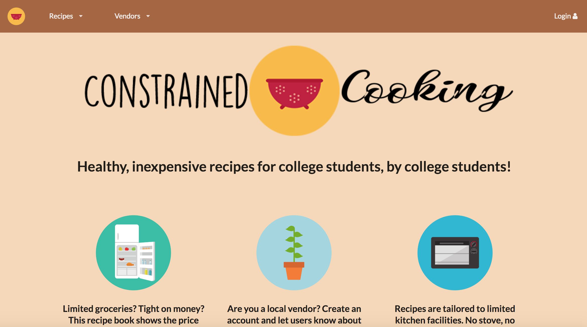
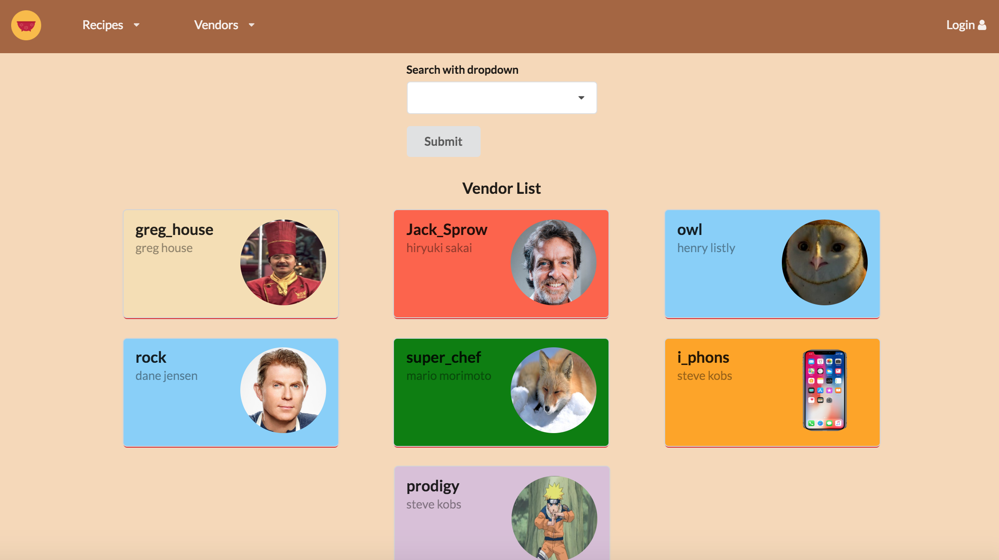

A year ago I had no idea how to make a website or even a webpage. From my perspective, everything on the internet was magic. I didn't realize more than one programming language is often used to build a website or even what servers and clients were. Fast forward to today, and while I'm not going to pretend like I became an expert in website development, compared to my former self, I'm a lot more knowledgeable than before. 

I first started with javascript and php, messing around with creating very basic looking interactive websites. I'd create html elements using pure javascript while making calls to a mysql database. I made no attempt to try and create visually appealing user interfaces and focused only on functionality. These first attempts were probably the most important steps I took. I gained a general overview on how websites worked and a rudimentary understanding on how to create them. This knowledge would prove useful in creating my first "real" website. 

After figuring out the basics on my own, school started and I took a class on web development. Here I learned about user interface frameworks and how to produce not only a functioning website, but also an appealing one that is easy for a user to use. 

I've come to understand that the internet is not magic. A lot of different components come together to produce the website we visit everyday. What I've created so far is just a start, I hope to build on these experiences to produce better websites in the future.