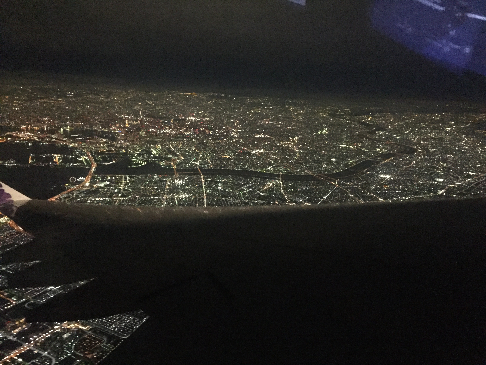

Although not my own, I have worked on creating websites for other people. I have used php for server-side scripting with databases and also have used javascript to create interactive user interfaces on the browser. Through these experience I've gained I have a fuller understanding about website implementation and design.  
