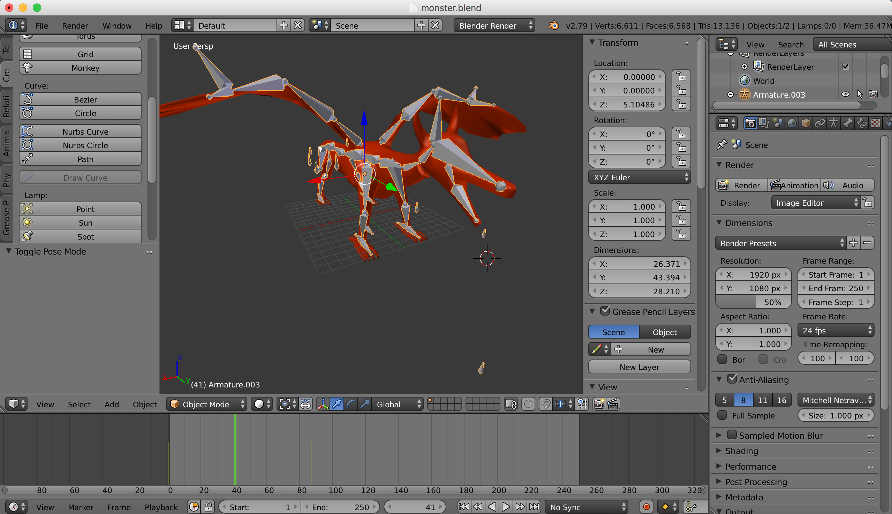

Blender is a free to use 3D modeling program. It has a wide variety of functionality and can be used to create digital art, animations and games along with other things. Since Blender is a free program, this makes it a very convenient tool for people with no experience in 3D computer modeling. There are also many videos and tutorials online that explain how to use the various features within Blender, making the process less painful.  

I've been experimenting with Blender over the past year and have come to realize that not all things can be finished in simply one step, rather, multiple different steps are often required.  This "dragon" which was one of my first "experiments" in Blender illustrates that process. First I had to create a model or "mesh" of the dragon consisting of vertices and polygons. A "material" was then applied to this mesh to give it a certain color, texture, etc. And finally "Armatures" were then added to allow the dragon to be posed. Each of these steps also took significant time for me, since I didn't know what I was doing. Thus, just to make a (honestly pretty bad looking) dragon that could be posed, took a couple of weeks for me to complete. 

I learned a lot about the design processes through Blender and am currently focusing on creating better meshes right now. 

If you would like to know more about Blender go here
