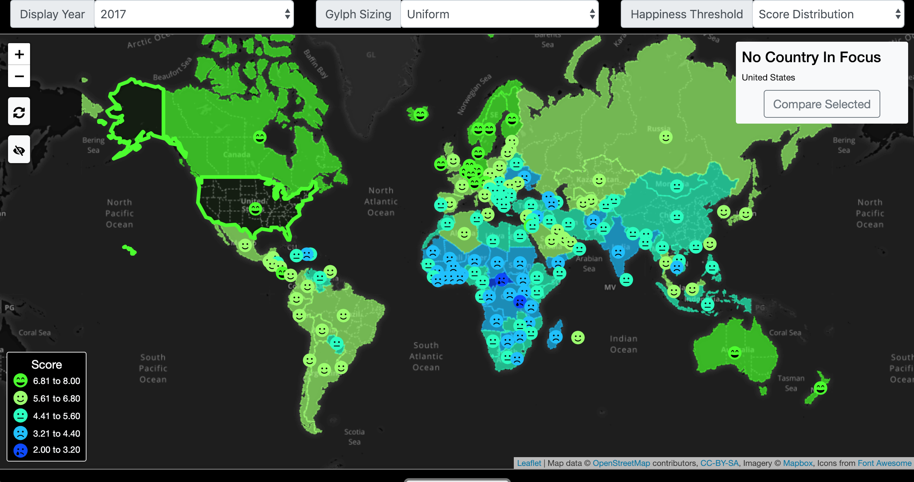

  
  
 
[Link to visualization](https://ics-484-fall-2018-team-app.github.io/Project-3/index.html#map)

[Link to github repository](https://github.com/ICS-484-Fall-2018-Team-App/Project-3)

In ICS 484 we were assigned a group project in where we had to find a data set and visualize it.

You can learn more about the world happiness report [here](http://worldhappiness.report/).

