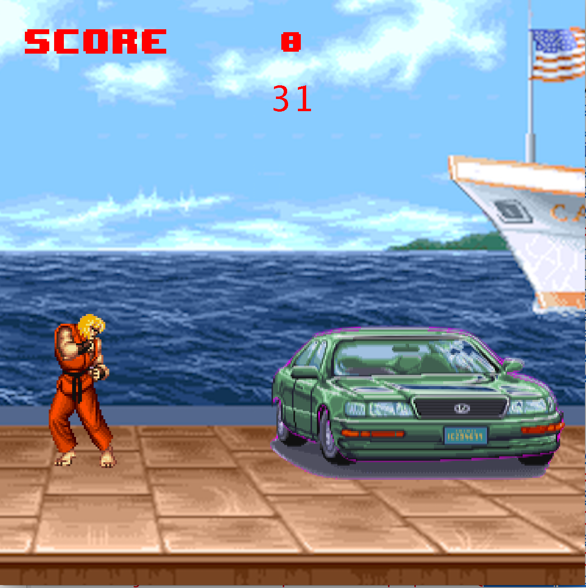

  
  

In the ICS 111 my partner and I created a basic Street Fighter like game where a user controlls the character on the screen to destroy a car. Various character poses were used to make it seem like the character was moving on the screen. This game was created using EZ.java, a graphics engine for java that makes graphics rendering very easy. 

You can learn more about EZ.java [here](http://www2.hawaii.edu/~dylank/ics111/).

