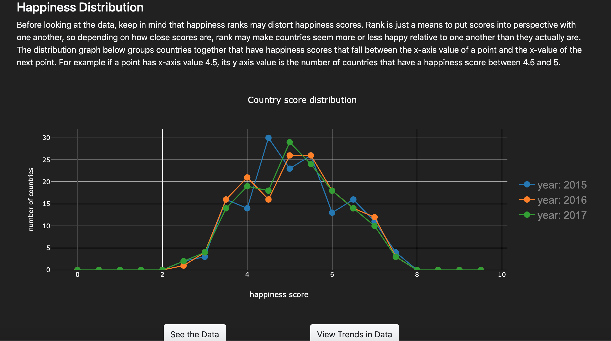

In ICS 484 we were assigned a group project in which we had to find a data set and visualize it.The data for this project was obtained from kaggle and was the World Happiness data from years 2015-2017. The goal of this was to visualize happiness around the world and if possible relate any metrics from the data itself to happiness. To do this we created an interactive map that allows users to compare happiness and happiness metrics of differnet countries to one another. Additionally, happiness metrics were graphed so trends could be seen.

  
  
 
The application consisted of two pages. The buttons, "See the Data" and "View Trends in Data" at the bottom of the second image (above) will take the user to the respective pages. One page was mainly for comparing countries with each other using an interactive map and another was for viewing overall trends in the data.
  
  
  
  
The interactive map (above) created using leaflet.js was the focus of our application. Using the glyphs (happy, sad, neutral faces) a user can see how happy countries are relative to one another. There are various features that can be changed such as, which year of data is being viewed, how glyphs are sized and what threshold is being used to determine glyphs. Additionally, countries can be toggled to a comparison list by clicking them. The countries that are to be compared are then displayed in the "No Country in Focus" Box. The "Compare Selected " button then takes the user to a graph section, where metrics that makeup a countries happiness score are compared. 

  
  
  

Various metrics for countries are compared to one another (above) to see how the different metrics affect a countries happiness. 

  
  

Additionally, overall trends for happiness metrics were graphed, to see if certain metrics generally equated to more happiness.  

Overall the project went well, as a group we continuously improved on the project when we saw fit and rarely had any Github commit conflicts. While we each had certain responsibilites, we were also continuously adding more content to keep on making the project better. 
 
## [Link to visualization](https://ics-484-fall-2018-team-app.github.io/Project-3/index.html)

[Link to github repository](https://github.com/ICS-484-Fall-2018-Team-App/Project-3)

You can learn more about the World Happiness report [here](http://worldhappiness.report/).

The World Happiness data can be found [here](https://www.kaggle.com/unsdsn/world-happiness).
