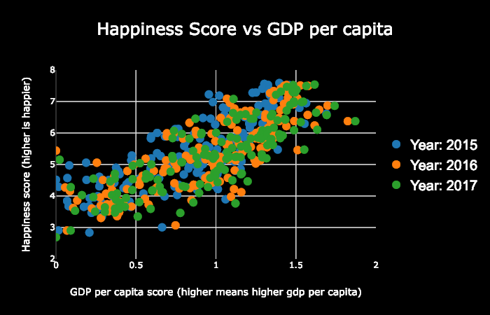

  
  
  
In ICS 484 we were assigned a group project in which we had to find a data set and visualize it.The data for this project was obtained from kaggle and was the happiness data from years 2015-2017. The goal of this was to visualize happiness around the world and if possible relate any metrics from the data itself to happiness. To do this we created an interactive map that allows users to compare happiness and happiness metrics of differnet countries to one another. Additionally, happiness metrics were graphed so trends could be seen.

  
 
[Link to visualization](https://ics-484-fall-2018-team-app.github.io/Project-3/index.html#map)

[Link to github repository](https://github.com/ICS-484-Fall-2018-Team-App/Project-3)

You can learn more about the world happiness report [here](http://worldhappiness.report/).
The data can be found [here](https://www.kaggle.com/unsdsn/world-happiness).
