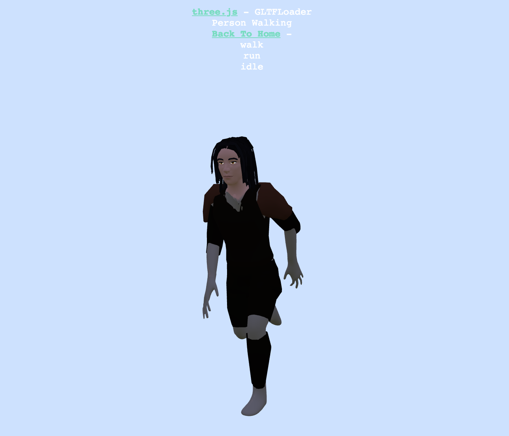

  
I made a few short animations in blender to experiment with animations for games. I then tried viewing the animations from my browser using Threejs.  

  
 
[Link to animation](https://akkamin.github.io/threejs_example/example/examples/webgl_loader_gltf.html)

[Link to github repository](https://github.com/akkamin/threejs_example)

