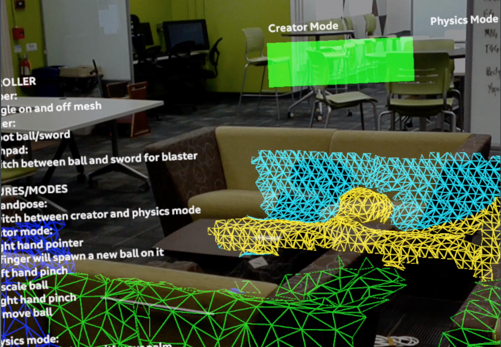
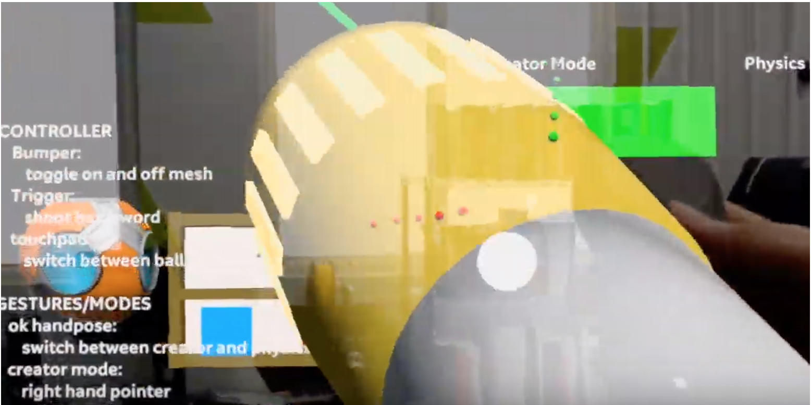
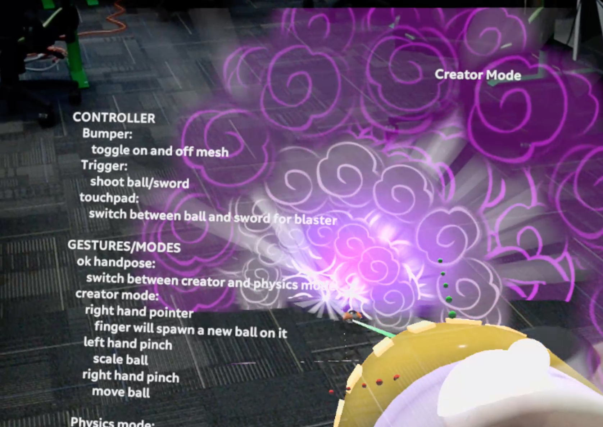
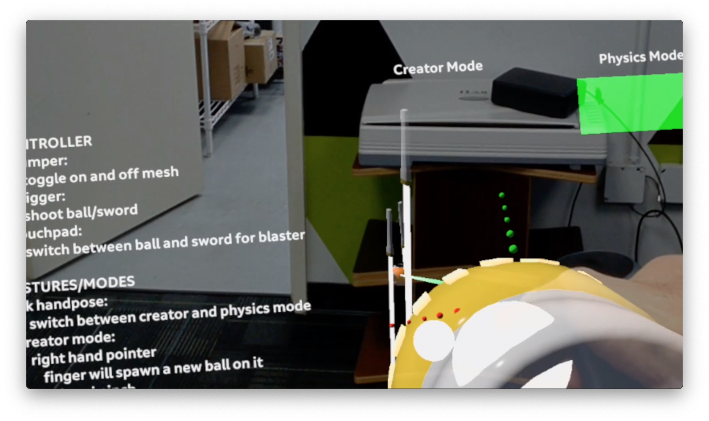
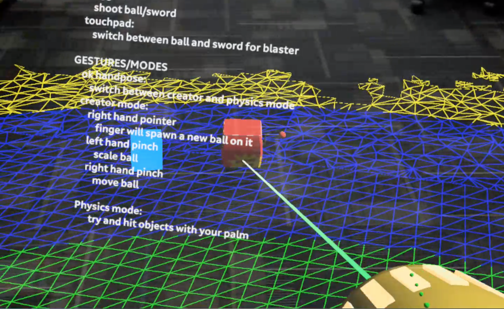
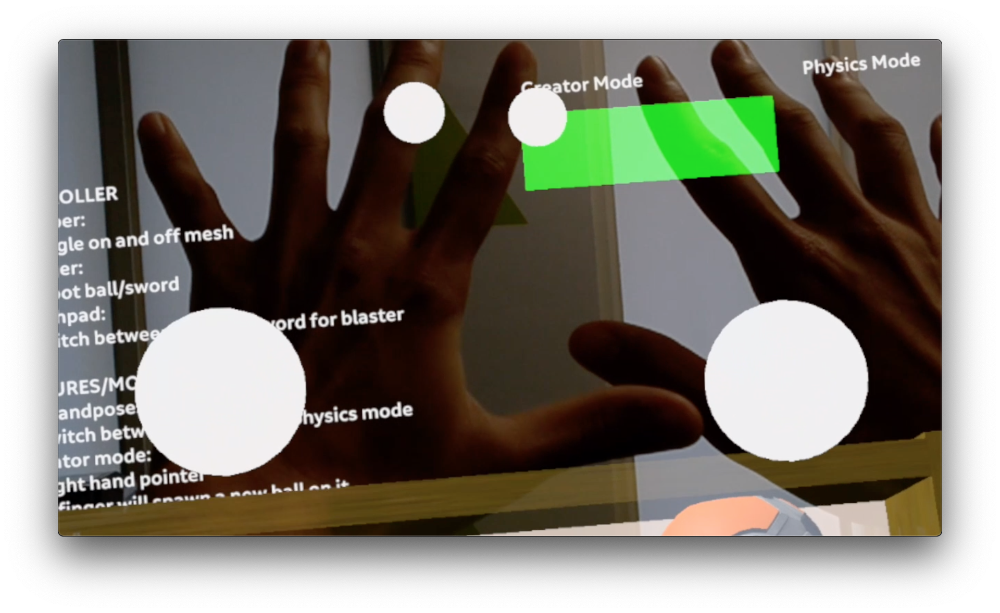
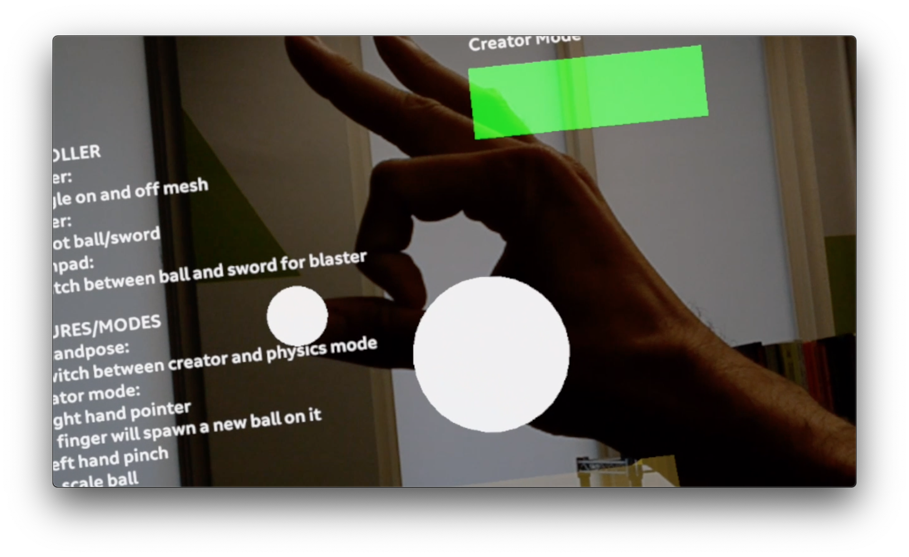
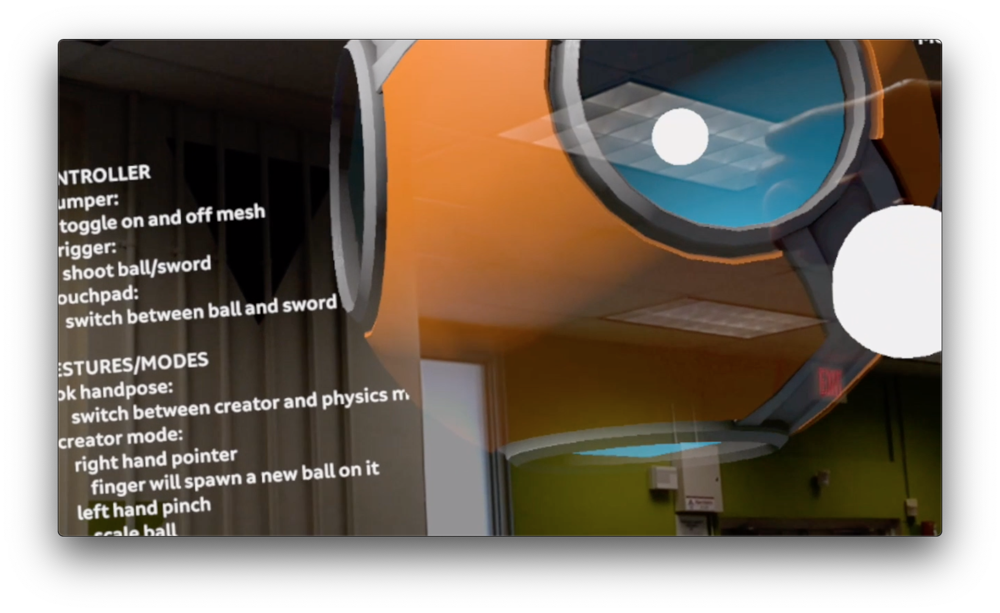

For an undergraduate research project I joined a team working with the Magic Leap augmented reality headset.  The ultimate goal of the project is to eventually use augmented or virtual reality to get kids with eating problems to eat. Since the project was just started, we wanted to show the clinitians who work with the kids thd differnt features the Magic Leap system has to offer. Using the Unity editor we created a demo showing the various features available in Magic Leap and walked the clinitions through the demo.

In order to explore the Magic Leap's interactivity, meshing, the controller, raycasting and hand tracking  features were mainly developed. 

### Meshing
The mesing feature in my opinion is one of the most important features in the Magic Leap. I'm not exactly sure how it is done technology wise, but cameras on the Magic Leap scan the area a user is in and build a virtual mesh based off of it. This is especially useful in immersing a user in augmented reality. Since a virtual mesh is created on top of physical objects, virtual objects, like a ball for example will seem to interact with the physical space through the Unity physics engine. Magic Leap also does a good job at making this feature easy to implement and use through its overall easy integration as well as dedicated tutorial on the Magic Leap website. In the image below, the meshing is the colored geometry overlaying the couches in the room. As evident in the image, the meshing feature is not perfect, but it still works well enough to create a good enough feeling of immersion. The biggest problem for me was the slow speed meshes are built and how easily meshes can be distored when the head set is moved quickly around.

### Controller
The most accurate way to interact with the virtual elements in a Magic Leap application is through the controller. Magic Leap does a nice job of building in a controller object that developers can fiddle around with. Originally, the controller object overlays a virtual Magic Leap controller over your own controller in your hand. However, I was able to easily customize the controller to instead display a yellow blaster. Naturally like any good demo, I had to make the blaster shoot a variety of objects when the trigger of the controller was pressed. 

### RayCasting
An easy way to interact with objects in the virtual space is through Unity's built in raycasting features. Using the controller, since it is more accurate and stable compared to the hands, I added in the ability for users to move objects around by placing a ball pointer onto objects and clicking a button on the controller. 

### Hand Tracking
One of the most interesting, yet also disappointing features of Magic Leap is its hand tracking. While the hand tracking features are simple to implement, they are lacking on their accuracy and responsiveness. The white balls in the images below are supposed to correlate to the center of my palms and the tips of my index fingers. In certain cases, the hand tracking is ok and gets the job done. However, when you move your hands around, the latency becomes very obvious. Additionally, depending on the angle you are viewing your hands the hand tracking can be very inaccurate. Currently the Magic Leap also supports around 7 hand gestures, these for the most part work quite well, though sometimes similarites between gestures can make it frustrating to work with. 

Perhaps in the future, Magic Leap will expand the hand tracking options to include user specified objects, but for now, the only objects the Magic Leap can currently recognize and track are a users hands or 2D images. 

### Image Tracking
Magic Leap does include a 2D image tracking feature. A user can upload an image and the Magic Leap headset will be able to recognize it. However, I had trouble recording this feature, as only one application can use the camera at a given time (ie I could not have image tracking enabled while also recording the video). On the Magic Leap discusison forms people have found loop holes to record and image track at the same time, but I decided to focus more on added more assets to the interactive environment instead of figuring out how to record and recognize 2D images at the same time. 

## [Link to Magic Leap application](https://www.youtube.com/watch?v=YALy7Kbbug8)

[Link to Magic Leap website](https://www.magicleap.com/creator)
 

