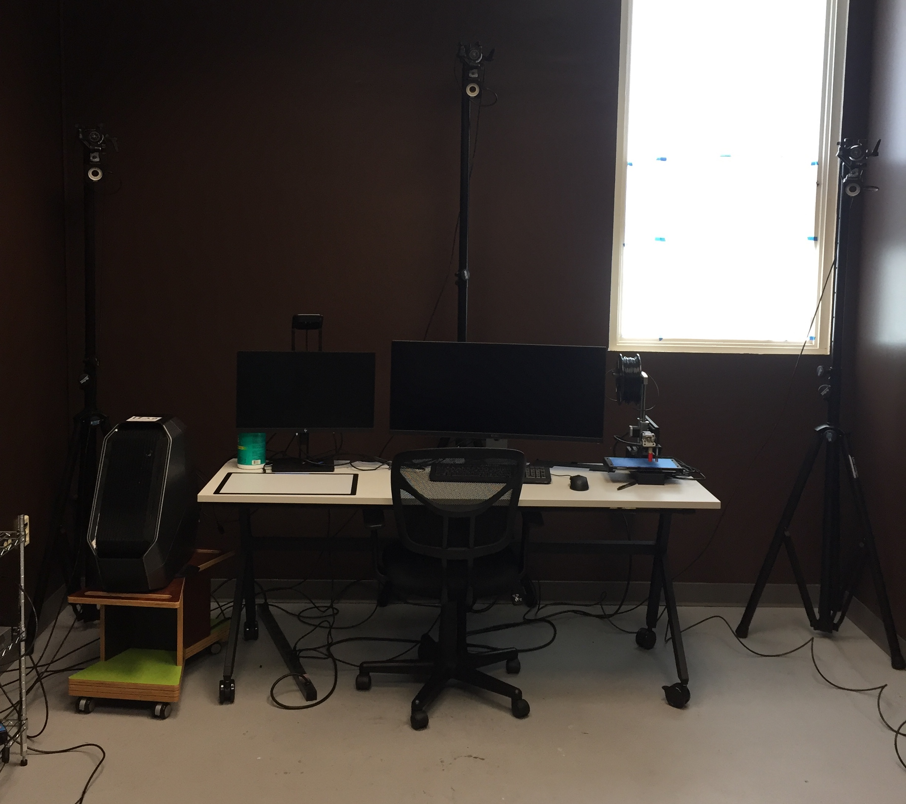
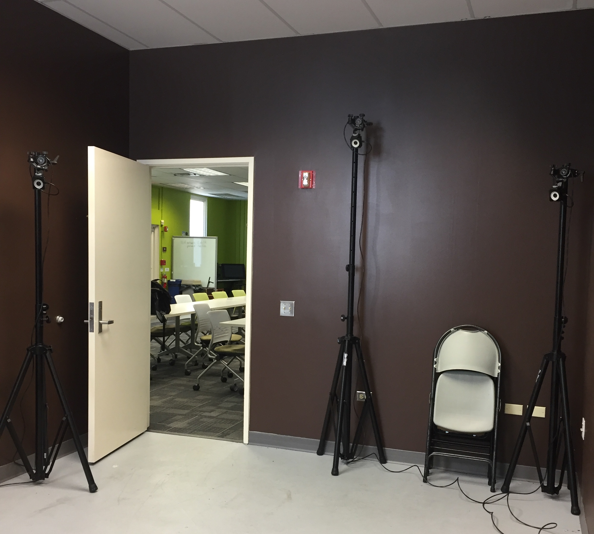

Over a semester I was tasked with setting up a motion capture workflow for an animation professor at the University of Hawaii. Using 6 Optitrack prime 13 cameras, I setup a motion capture space and documented the whole process. Having no prior experience with motion capture I had to learn how to use various programs such as Motive, MotionBuilder and Maya as well as how to work with and calibrate the cameras themselves. I did this through existing documentation a previous student made and online searching. 

Since the cameras are mounted on tripods, I was able to experiment with a variety of spaces. Ultimately, because the professor wanted to keep the setup somewhat perminant, I moved it into the room pictured below. One constraint of optical motion capture is that a marker needs to be seen by at least two cameras at all times. Therefore, the capture area is not actually the whole room, but a box marked in black tape. 

  
  

This was an enjoyable experience for me because prior to setting up the motion capture system, I had been using the 3D modelling program blender for a couple of years. Thus I was able to experience the entire motion capture animation workflow from start to finish. I was able to create a humaniod character in Blender, rig it up, and then animate it using data captured from the motion capture cameras. 

I created and rigged the person with armor (based off of the Halo game series) in Blender. Using the Motive software, we captured the movements of a person. With the data from Motive, I then retargeted the motion capture data onto my person in MotionBuilder and finally rendered the scene in Maya, using the Arnold rendering Engine.

It was a good experience, learning new things in this project. 
## [Link to Motion Capture Animation](https://www.youtube.com/watch?v=vfY5W93c0M0)
 

