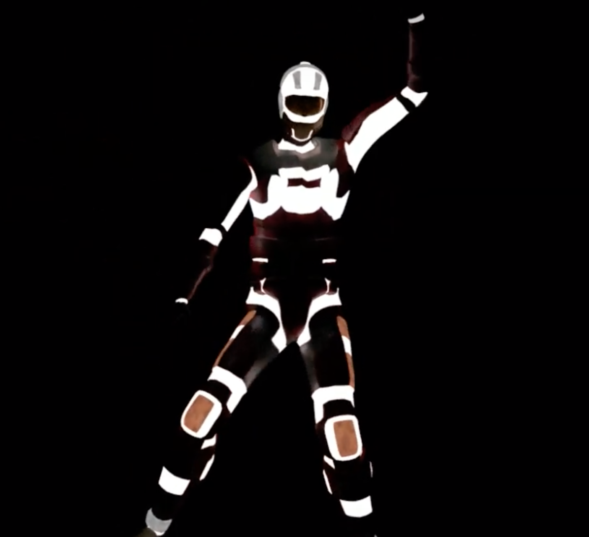

  
Over a semester I was tasked with setting up a motion capture workflow for an animation professor at the University of Hawaii. Using 6 Optitrack prime 13 cameras, I setup a motion capture space and documented the whole process. Having no prior experience with motion capture I had to learn how to use various programs such as Motive, MotionBuilder and Maya as well as how to work with and calibrate the cameras themselves. It was a good experience that taught me a lot. 

[Link to Video](https://www.youtube.com/watch?v=vfY5W93c0M0)

