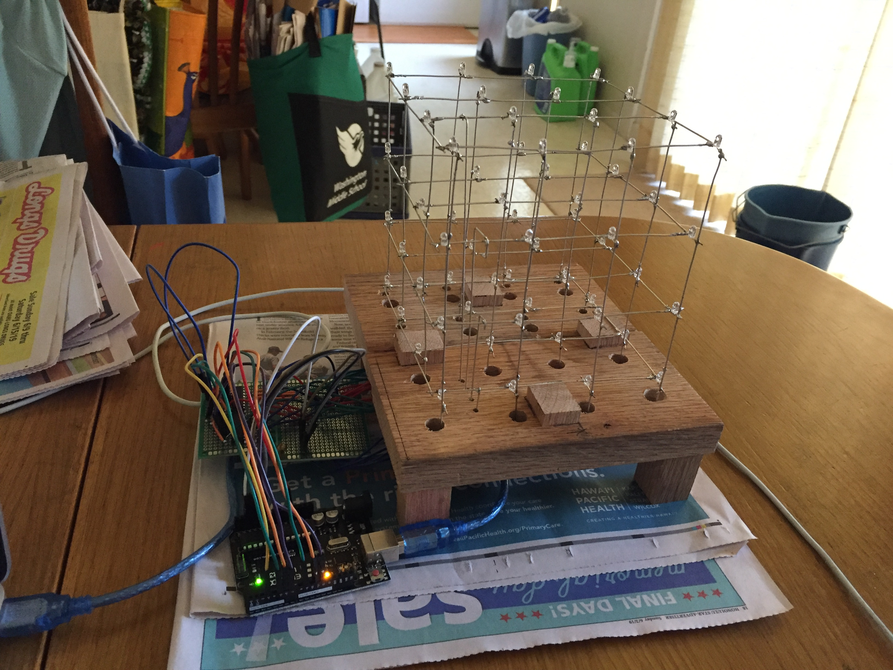
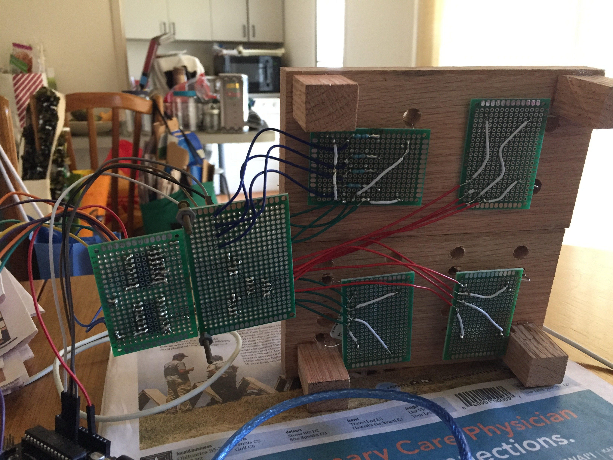

 

## Why a LED Cube?
Since my educational background mainly focused on software and creating applications for laptops and desktop computers, I decided to try my hand at working with circuits and microcontrollers like the Arduino. It was quite interesting because aside from a single physics lab I didn't have any experience building and soldering circuits. I learned what I needed from guides and videos found online. 

## Creating the Cube
The cube is made from wire and LED's. Following this [guide](https://www.instructables.com/id/LED-Cube-4x4x4/) I first made a template to create uniform cube layers. I cut and straightened wire and soldered it onto the LED's. I actually ended up doing this whole process twice, since the first template I made was really poor quality. Once the structure of the cube was completed I tested how I would go about making the circuit using a bread board. Two shift registers were used to turn columns of the cube on and off, as I did not want too many cables connected to the Arduino. 

Once I figured out the wiring scheme I used small printed circuit boards to wire everything together. Ideally, a single large cirucit board would have been better, but I did not have a circuit board of that size. 

## Programming the Cube
Initially I made some LED patterns by turning on and off Layers and columns. This was somewhat interesting, but I felt like the cube wasn't being fully utilized. After some thought, my next goal then became to make a music visualizer. Come on, blinking LED's and electronic music were made for each other.

 

To create the music visualizer, I needed a way to stream audio data from mp3 files on my computer to the Arduino. I did this using serial communication between the Arduino and a [Processing](https://processing.org/) program I found online [here](https://abhikpal.github.io/blog/2014/01/16/simple-music-visualizer). After experimenting a little with it I realized I needed to make the LED's dimmable. This required more bread board experimentation and soldering more wires to the circuit boards. Once I was able to make the LED's dimmable I played around with using the amplitude of the sound as a brightness driver and turning patterns on and off based on arbitrary sound amplitude thresholds.

## Future
The cube is still very much a work in progress. Honestly the music visualizer I have right now isn't very good and I plan on seeing how sound wave frequencies might also affect visualization results. Additionally, since the cube is recieving data through serial communication with my laptop there are occasional disconnects between light and sound, I'd like to eventually try and add an SD card reader to the Arduino so it can read its own sound files without having to go through intermediate serial communications. Another thing I'd like to experiment with is having the cube react to data driven events, like weather for example and maybe later along try and make the cube recieve data wirelessly. 

## Learning
For the most part everything I needed to know I learned from the [LED cube guide](https://www.instructables.com/id/LED-Cube-4x4x4/), [LED cube Arduino code](https://www.instructables.com/id/4x4x4-LED-Cube-Arduino-Uno/) and the [Processing program for serial communication with Arduino](https://abhikpal.github.io/blog/2014/01/16/simple-music-visualizer) along with general internet searches. I am a complete novice at circuit building so I think it would be unwise if I added in a picture of my circuit setup since it might honestly be a fire hazard. 

## Links to Guides and code
[LED cube guide](https://www.instructables.com/id/LED-Cube-4x4x4/)

[LED cube Arduino code](https://www.instructables.com/id/4x4x4-LED-Cube-Arduino-Uno/)

[Processing program for serial communication with Arduino](https://abhikpal.github.io/blog/2014/01/16/simple-music-visualizer)

[Processing download](https://processing.org/)
  

